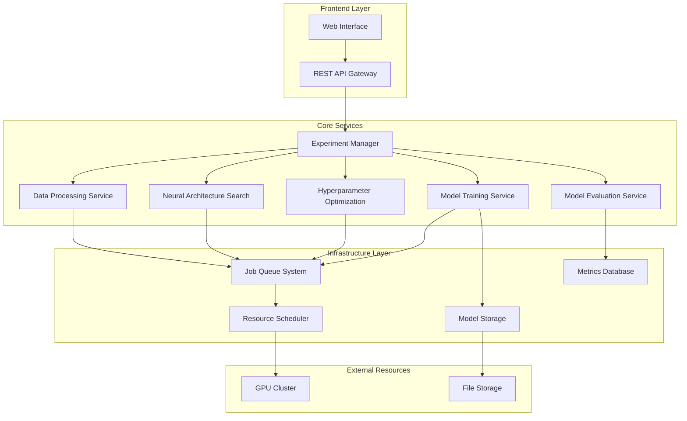

# Design Document

## Overview

The AutoML Framework is a web-based platform that automates the entire deep learning pipeline from data preprocessing to model deployment. The system employs a microservices architecture with separate services for data processing, neural architecture search, hyperparameter optimization, model training, and deployment management.

The framework supports multiple deep learning backends (TensorFlow, PyTorch) and provides both REST APIs and a web interface for user interaction. The system is designed to handle concurrent experiments, efficient resource utilization, and scalable model training across multiple GPUs.

## Architecture

### High-Level Architecture



### Service Architecture

The system follows a microservices pattern with the following core services:

1. **API Gateway**: Handles authentication, request routing, and rate limiting
2. **Experiment Manager**: Orchestrates the AutoML pipeline and manages experiment lifecycle
3. **Data Processing Service**: Handles data ingestion, preprocessing, and feature engineering
4. **Neural Architecture Search Service**: Implements NAS algorithms for architecture discovery
5. **Hyperparameter Optimization Service**: Manages hyperparameter search strategies
6. **Model Training Service**: Handles distributed model training and monitoring
7. **Model Evaluation Service**: Provides comprehensive model evaluation and comparison
8. **Resource Scheduler**: Manages GPU allocation and job queuing

## Components and Interfaces

### Data Processing Component

**Purpose**: Automated data preprocessing and feature engineering

**Key Classes**:
- `DatasetAnalyzer`: Analyzes dataset characteristics and suggests preprocessing steps
- `PreprocessingPipeline`: Applies transformations like normalization, encoding, and feature selection
- `FeatureEngineer`: Generates domain-specific features based on data type

**Interfaces**:
```python
class IDataProcessor:
    def analyze_dataset(self, dataset_path: str) -> DatasetMetadata
    def create_preprocessing_pipeline(self, metadata: DatasetMetadata) -> Pipeline
    def apply_preprocessing(self, pipeline: Pipeline, data: DataFrame) -> ProcessedData
```

### Neural Architecture Search Component

**Purpose**: Automated discovery of optimal neural network architectures

**Key Classes**:
- `NASController`: Manages the architecture search process
- `ArchitectureGenerator`: Generates candidate architectures based on search space
- `PerformancePredictor`: Estimates architecture performance without full training

**Search Strategies**:
- Differentiable Architecture Search (DARTS)
- Evolutionary Neural Architecture Search
- Reinforcement Learning-based search

**Interfaces**:
```python
class INASService:
    def define_search_space(self, task_type: TaskType) -> SearchSpace
    def search_architectures(self, search_space: SearchSpace, dataset: Dataset) -> List[Architecture]
    def evaluate_architecture(self, architecture: Architecture, dataset: Dataset) -> PerformanceMetrics
```

### Hyperparameter Optimization Component

**Purpose**: Automated hyperparameter tuning using advanced optimization techniques

**Key Classes**:
- `BayesianOptimizer`: Implements Bayesian optimization for hyperparameter search
- `HyperparameterSpace`: Defines the search space for hyperparameters
- `OptimizationHistory`: Tracks optimization progress and results

**Optimization Methods**:
- Bayesian Optimization with Gaussian Processes
- Tree-structured Parzen Estimator (TPE)
- Population-based training
- Random search and grid search fallbacks

**Interfaces**:
```python
class IHyperparameterOptimizer:
    def define_search_space(self, architecture: Architecture) -> HyperparameterSpace
    def optimize(self, objective_function: Callable, search_space: HyperparameterSpace) -> OptimalConfig
    def get_optimization_history(self) -> List[Trial]
```

### Model Training Component

**Purpose**: Distributed model training with monitoring and early stopping

**Key Classes**:
- `DistributedTrainer`: Manages multi-GPU training
- `TrainingMonitor`: Tracks training metrics and implements early stopping
- `CheckpointManager`: Handles model checkpointing and recovery

**Features**:
- Automatic mixed precision training
- Dynamic learning rate scheduling
- Gradient clipping and regularization
- Real-time training visualization

**Interfaces**:
```python
class IModelTrainer:
    def train_model(self, architecture: Architecture, config: TrainingConfig, dataset: Dataset) -> TrainedModel
    def monitor_training(self, training_job: TrainingJob) -> TrainingMetrics
    def save_checkpoint(self, model: Model, epoch: int) -> CheckpointPath
```

## Data Models

### Core Data Models

```python
@dataclass
class Dataset:
    id: str
    name: str
    file_path: str
    data_type: DataType  # IMAGE, TEXT, TABULAR, TIME_SERIES
    size: int
    features: List[Feature]
    target_column: Optional[str]
    metadata: Dict[str, Any]

@dataclass
class Architecture:
    id: str
    layers: List[Layer]
    connections: List[Connection]
    input_shape: Tuple[int, ...]
    output_shape: Tuple[int, ...]
    parameter_count: int
    flops: int

@dataclass
class Experiment:
    id: str
    name: str
    dataset_id: str
    status: ExperimentStatus
    created_at: datetime
    completed_at: Optional[datetime]
    best_model: Optional[TrainedModel]
    results: ExperimentResults

@dataclass
class TrainingConfig:
    batch_size: int
    learning_rate: float
    optimizer: str
    epochs: int
    early_stopping_patience: int
    regularization: Dict[str, float]

@dataclass
class PerformanceMetrics:
    accuracy: float
    loss: float
    precision: float
    recall: float
    f1_score: float
    training_time: float
    inference_time: float
```

### Database Schema

The system uses a combination of relational (PostgreSQL) and document (MongoDB) databases:

**PostgreSQL Tables**:
- `experiments`: Experiment metadata and status
- `datasets`: Dataset information and file paths
- `models`: Trained model metadata and performance
- `users`: User accounts and permissions

**MongoDB Collections**:
- `architectures`: Neural network architecture definitions
- `training_logs`: Detailed training metrics and logs
- `hyperparameter_trials`: Hyperparameter optimization history

## Error Handling

### Error Categories

1. **Data Errors**: Invalid datasets, corrupted files, unsupported formats
2. **Resource Errors**: Insufficient GPU memory, storage limits exceeded
3. **Training Errors**: Model convergence failures, numerical instabilities
4. **System Errors**: Service unavailability, network timeouts

### Error Handling Strategy

```python
class AutoMLException(Exception):
    def __init__(self, message: str, error_code: str, recoverable: bool = False):
        self.message = message
        self.error_code = error_code
        self.recoverable = recoverable

class ErrorHandler:
    def handle_data_error(self, error: DataError) -> ErrorResponse:
        # Log error, suggest data fixes, return user-friendly message
        
    def handle_resource_error(self, error: ResourceError) -> ErrorResponse:
        # Queue job for retry, estimate wait time, notify user
        
    def handle_training_error(self, error: TrainingError) -> ErrorResponse:
        # Attempt recovery with adjusted parameters, fallback to simpler model
```

### Recovery Mechanisms

- **Automatic Retry**: Failed jobs are automatically retried with adjusted parameters
- **Graceful Degradation**: If advanced features fail, fallback to simpler alternatives
- **Checkpoint Recovery**: Training can resume from the last saved checkpoint
- **Resource Reallocation**: Jobs are moved to available resources when current resources fail

## Testing Strategy

### Unit Testing

- **Component Testing**: Each service component has comprehensive unit tests
- **Mock Dependencies**: External dependencies are mocked for isolated testing
- **Edge Case Coverage**: Tests cover boundary conditions and error scenarios

### Integration Testing

- **Service Integration**: Tests verify communication between microservices
- **Database Integration**: Tests ensure proper data persistence and retrieval
- **API Testing**: REST API endpoints are tested for correct request/response handling

### End-to-End Testing

- **Complete Pipeline**: Tests run full AutoML experiments from data upload to model deployment
- **Performance Testing**: Load testing ensures system handles concurrent users
- **Resource Testing**: Tests verify proper GPU allocation and cleanup

### Testing Infrastructure

```python
class AutoMLTestSuite:
    def test_data_processing_pipeline(self):
        # Test complete data preprocessing workflow
        
    def test_nas_architecture_search(self):
        # Test architecture search with synthetic datasets
        
    def test_hyperparameter_optimization(self):
        # Test optimization convergence and result quality
        
    def test_distributed_training(self):
        # Test multi-GPU training coordination
        
    def test_experiment_orchestration(self):
        # Test complete experiment lifecycle management
```

### Continuous Integration

- **Automated Testing**: All tests run on every code commit
- **Performance Benchmarks**: Regular performance regression testing
- **Model Quality Checks**: Automated validation of model training results
- **Security Scanning**: Regular security vulnerability assessments