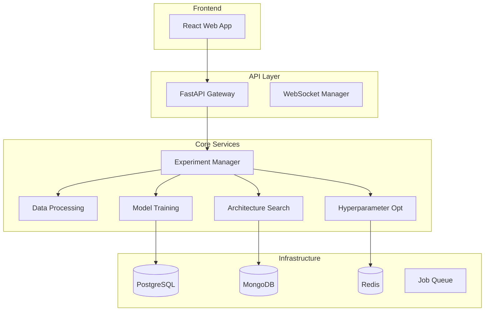

# AutoML Framework

A comprehensive automated machine learning platform that streamlines the entire deep learning pipeline from data preprocessing to model deployment. The framework provides intelligent automation for neural architecture search, hyperparameter optimization, and distributed model training.

## 🚀 Features

- **Automated Neural Architecture Search (NAS)**: Discover optimal network architectures using DARTS and evolutionary algorithms
- **Intelligent Hyperparameter Optimization**: Bayesian optimization and TPE for efficient parameter tuning
- **Distributed Training**: Multi-GPU support with automatic resource management
- **Real-time Monitoring**: Live experiment tracking with WebSocket updates
- **Model Deployment**: Export models in multiple formats (ONNX, TensorFlow, PyTorch)
- **Web Interface**: Intuitive React-based dashboard for experiment management
- **REST API**: Comprehensive API for programmatic access
- **Monitoring & Observability**: Integrated Prometheus, Grafana, and alerting

## 📋 Table of Contents

- [Quick Start](#quick-start)
- [Installation](#installation)
- [Development Setup](#development-setup)
- [Usage](#usage)
- [API Documentation](#api-documentation)
- [Architecture](#architecture)
- [Contributing](#contributing)
- [Troubleshooting](#troubleshooting)
- [License](#license)

## ⚡ Quick Start

Get the AutoML Framework running in under 5 minutes:

```bash
# Clone the repository
git clone <repository-url>
cd automl-framework

# Start all services with Docker (recommended)
./scripts/dev-start.sh

# Or start with specific profile
./scripts/dev-start.sh -p api --no-monitoring
```

Access the services:
- **Web Interface**: http://localhost:3000
- **API Documentation**: http://localhost:8000/docs
- **Monitoring Dashboard**: http://localhost:3001 (admin/admin)

## 🛠️ Installation

### Prerequisites

- **Docker & Docker Compose** (recommended)
- **Python 3.8+** (for native development)
- **Node.js 16+** (for frontend development)
- **NVIDIA GPU** (optional, for GPU acceleration)

### System Requirements

- **Memory**: 8GB RAM minimum, 16GB recommended
- **Storage**: 10GB free space
- **GPU**: NVIDIA GPU with CUDA 11.0+ (optional)

### Docker Installation (Recommended)

```bash
# Install Docker and Docker Compose
# On macOS with Homebrew:
brew install docker docker-compose

# On Ubuntu:
sudo apt-get update
sudo apt-get install docker.io docker-compose

# Verify installation
docker --version
docker-compose --version
```

### Native Installation

```bash
# Install Python dependencies
python3 -m venv venv
source venv/bin/activate  # On Windows: venv\Scripts\activate
pip install -r requirements.txt

# Install Node.js dependencies (for frontend)
cd ui
npm install
cd ..
```

## 🔧 Development Setup

### Quick Development Start

```bash
# Start all services in development mode
./scripts/dev-start.sh

# Start only databases (for native development)
./scripts/dev-start.sh -p minimal

# Start in hybrid mode (databases in Docker, services native)
./scripts/dev-start.sh -m hybrid
```

### Development Modes

| Mode | Description | Use Case |
|------|-------------|----------|
| `docker` | All services in containers | Production-like environment |
| `native` | All services run natively | Active development |
| `hybrid` | Databases in Docker, services native | Balanced development |

### Service Profiles

| Profile | Services | Description |
|---------|----------|-------------|
| `minimal` | Databases only | Backend development |
| `api` | Databases + API | API development |
| `full` | All services | Complete system |

### Environment Configuration

The development script automatically creates `.env.dev` with sensible defaults:

```bash
# View current configuration
cat .env.dev

# Customize for your environment
export CUDA_VISIBLE_DEVICES=0,1  # Use specific GPUs
export LOG_LEVEL=DEBUG           # Enable debug logging
```

## 📖 Usage

### Web Interface

1. **Upload Dataset**: Navigate to the dashboard and upload your CSV/image data
2. **Create Experiment**: Configure experiment parameters and start AutoML
3. **Monitor Progress**: Watch real-time training metrics and architecture search
4. **Deploy Model**: Export trained models in your preferred format

### API Usage

```python
import requests

# Upload dataset
files = {'file': open('dataset.csv', 'rb')}
response = requests.post('http://localhost:8000/api/v1/datasets/upload', files=files)
dataset_id = response.json()['dataset_id']

# Create experiment
experiment_config = {
    'name': 'My AutoML Experiment',
    'dataset_id': dataset_id,
    'task_type': 'classification',
    'max_trials': 50,
    'max_epochs': 100
}
response = requests.post('http://localhost:8000/api/v1/experiments', json=experiment_config)
experiment_id = response.json()['experiment_id']

# Monitor experiment
response = requests.get(f'http://localhost:8000/api/v1/experiments/{experiment_id}')
status = response.json()['status']
```

### Command Line Tools

```bash
# Check service health
./scripts/dev-health.sh

# View logs
./scripts/dev-start.sh --logs

# Stop all services
./scripts/dev-stop.sh

# Database management
./scripts/dev-migrate.sh --init    # Initialize databases
./scripts/dev-migrate.sh --seed    # Add sample data
./scripts/dev-migrate.sh --status  # Check status
```

## 📚 API Documentation

### Interactive Documentation

- **Swagger UI**: http://localhost:8000/docs
- **ReDoc**: http://localhost:8000/redoc

### Key Endpoints

| Endpoint | Method | Description |
|----------|--------|-------------|
| `/api/v1/datasets/upload` | POST | Upload dataset |
| `/api/v1/experiments` | POST | Create experiment |
| `/api/v1/experiments/{id}` | GET | Get experiment status |
| `/api/v1/experiments/{id}/results` | GET | Get experiment results |
| `/api/v1/models/{id}/export` | POST | Export trained model |

### WebSocket Events

Connect to `ws://localhost:8000/ws/experiments/{experiment_id}` for real-time updates:

```javascript
const ws = new WebSocket('ws://localhost:8000/ws/experiments/exp-123');
ws.onmessage = (event) => {
    const data = JSON.parse(event.data);
    console.log('Training progress:', data.metrics);
};
```

## 🏗️ Architecture

### System Overview



### Technology Stack

- **Backend**: Python, FastAPI, SQLAlchemy, PyTorch, TensorFlow
- **Frontend**: React, TypeScript, Vite, Tailwind CSS
- **Databases**: PostgreSQL, MongoDB, Redis
- **Monitoring**: Prometheus, Grafana, Alertmanager
- **Deployment**: Docker, Kubernetes, Nginx

## 🤝 Contributing

We welcome contributions! Please see our [Contributing Guide](CONTRIBUTING.md) for details.

### Development Workflow

1. Fork the repository
2. Create a feature branch: `git checkout -b feature/amazing-feature`
3. Make your changes and add tests
4. Run the test suite: `python -m pytest`
5. Submit a pull request

### Code Style

```bash
# Format code
black automl_framework/
isort automl_framework/

# Lint code
flake8 automl_framework/
mypy automl_framework/

# Run tests
pytest tests/ -v
```

## 🔍 Troubleshooting

### Common Issues

#### Services Won't Start

```bash
# Check system resources
df -h                    # Disk space
free -h                  # Memory usage
docker system df         # Docker space usage

# Clean up Docker resources
docker system prune -f
./scripts/dev-start.sh --clean
```

#### Database Connection Issues

```bash
# Check database status
./scripts/dev-health.sh

# Reset databases
./scripts/dev-migrate.sh --reset

# Check logs
docker-compose logs postgres mongodb redis
```

#### GPU Not Detected

```bash
# Check NVIDIA drivers
nvidia-smi

# Verify Docker GPU support
docker run --rm --gpus all nvidia/cuda:11.0-base nvidia-smi

# Update Docker Compose for GPU
# Ensure docker-compose.yml includes GPU configuration
```

#### Port Conflicts

```bash
# Check what's using ports
lsof -i :8000  # API port
lsof -i :3000  # Frontend port
lsof -i :5432  # PostgreSQL port

# Kill conflicting processes
kill -9 <PID>
```

### Performance Issues

#### Slow Training

- Ensure GPU is available and configured
- Check memory usage: `nvidia-smi`
- Reduce batch size or model complexity
- Enable mixed precision training

#### High Memory Usage

- Monitor with: `./scripts/dev-health.sh --watch`
- Reduce worker concurrency
- Clear old checkpoints and logs
- Restart services: `./scripts/dev-start.sh --restart`

### Getting Help

1. **Check Logs**: `./scripts/dev-start.sh --logs`
2. **Health Check**: `./scripts/dev-health.sh`
3. **Documentation**: Visit http://localhost:8000/docs
4. **Issues**: Create a GitHub issue with logs and system info

### Debug Mode

```bash
# Enable debug logging
export LOG_LEVEL=DEBUG

# Start with verbose output
./scripts/dev-start.sh -m native --logs

# Check service health continuously
./scripts/dev-health.sh --watch
```

## 📄 License

This project is licensed under the MIT License - see the [LICENSE](LICENSE) file for details.

## 🙏 Acknowledgments

- Built with [FastAPI](https://fastapi.tiangolo.com/) and [React](https://reactjs.org/)
- Neural Architecture Search inspired by [DARTS](https://arxiv.org/abs/1806.09055)
- Hyperparameter optimization using [Optuna](https://optuna.org/)
- Monitoring powered by [Prometheus](https://prometheus.io/) and [Grafana](https://grafana.com/)

---

**Happy AutoML! 🤖✨**